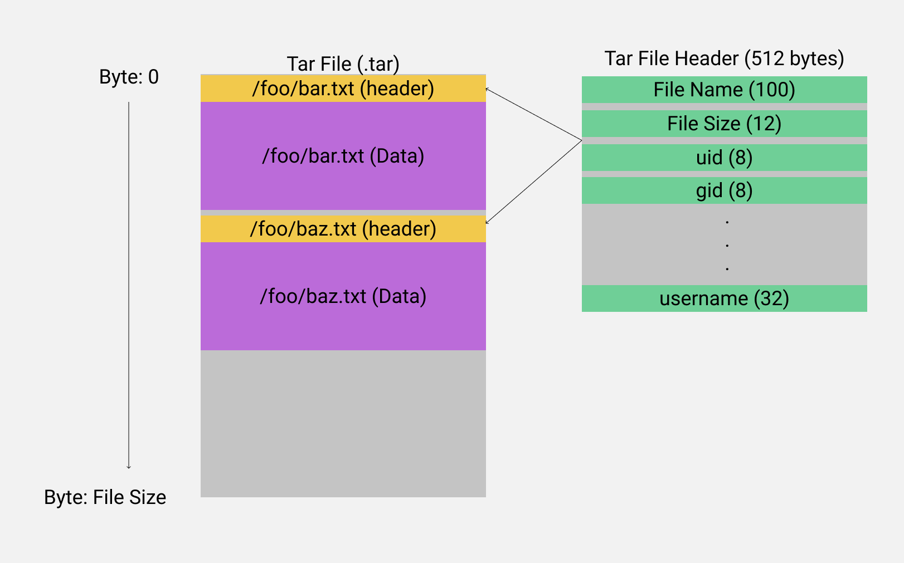
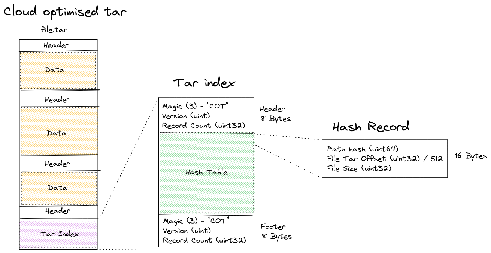

# Cotar - Cloud optimized tar archive

.tar + .tar.index + AWS S3 = :heart:

## Why

Storing 100,000,000's of small file in cloud providers (S3, GCP) is expensive as each individual file update counts as a put request and for each 1M files costs around $5 USD to add to Amazon S3. This often limits how often files can be updated.

To work around this issue files can be packed into a archive so there is only one put/get request to receive all the files. However generally to extract a single file from most archives generally requires a full copy of the archive to find the file and extract it. This forces the user to download GBs of data when they only want a single file of a few KB.

Cotar works by creating a index of any `.tar` file whereby any individual file inside the archive can be extracted by using a single HTTP range request to the `.tar` archive.

## Requirements

- Supports any tar file and any contents - Currently focused on Mapbox vector tiles (MVT)
- Should be able to handle large 100GB+ tar files with millions of internal files
- Index should be small and/or compressed to save space
- Should be able to fetch ideally any file inside a archive with a minimal amount of requests (Ideally 1-2)

## Tar files

TAR files contain a collection of files stored sequentially into the file. With every file containing a 512 byte header just before the file data is stored.

This makes it very easy to add new files to a archive as more files can just be appended to the end, however this makes random reads impossible, as every file header would have to be read until the specific file wanted would be found 

### Tar Index
TAR Index (.index) is a binary file containing the location and size of a file inside of a tar. with this index a tar file can be randomly read.

### Limits

- Internal file count is limited to `uint32` this limits the tar to ~4 Billion files
- Internal file sizes are limited to `uint32` this stops the indexer from indexing files inside the tar that are over 4GB in size
- Internal File block offsets are limited to `uint32` however tar's are block aligned at 512 byte intervals so the final tar size is limited to 2TB

### V1 To V2

V1 was using 24 bytes per index record, using `uint64` for hash, file offset and file size. This was inefficient as most files inside the archives are < 100KB in size

V2 moves to a uint32 for offsets, it changes from raw byte offset in the file to block offset. tar files are block algined at 512byte intervals. to get the raw offset `const rawOffset = blockOffset * 512` this limits the tar to 2TB in size.

V2 moves to uint32 for file size this limits internal files to 4GB in size

### Performance

Performance regression is monitored with [hyperfine-action](https://github.com/blacha/hyperfine-action) with results being hosted on github pages [benchmarks.html](https://linz.github.io/cotar/benchmarks.html)

#### Questions:
**Hash size**
The type of the hash could be changed as well as the number of bits of the hash used based on how unique the file hashes are, a uint64 hash is mostly completely wasted on a tar file containing 100 files. 
conversely a tar file containing 2,000,000 files needs a hash much larger than 16bits

**Hash type**
`FNV-1a` was chosen as it is implementation simplicity and provides a pretty good [distribution](https://softwareengineering.stackexchange.com/questions/49550/which-hashing-algorithm-is-best-for-uniqueness-and-speed) of hash values for a 64bit hash. 
Any hash type could be used `farmhash` or even `sha256` and then the bits sliced down to the number needed for the hash index.

## Future investigation

1. Zip files

ZIP store their metadata at the end of the file, and so the metadata can be read with a single range request for the last 1+MB of data.
then individual files can be read directly from the ZIP.

See: https://github.com/tapalcatl/tapalcatl-2-spec
> 2021-04 comments
> The internal zip header is quite large with a 600,000 file test zip, the header was 55MB vs a 5MB gziped header using JSON

2. Combine tar with tar.index into a single tar

Having a single tar file greatly simplifies the distribution of the files, It would be quite simple to tar both the index (.tar.index) and data tar into another tar to combine the files into a single distribution

> 2022-01 done

3. Use AWS S3's response-encoding to decompress internal gziped content on the fly

